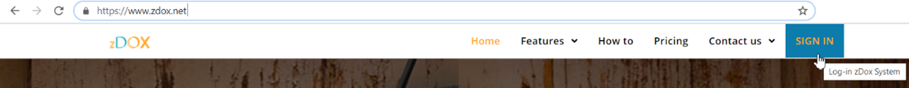
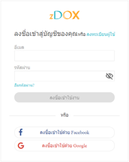
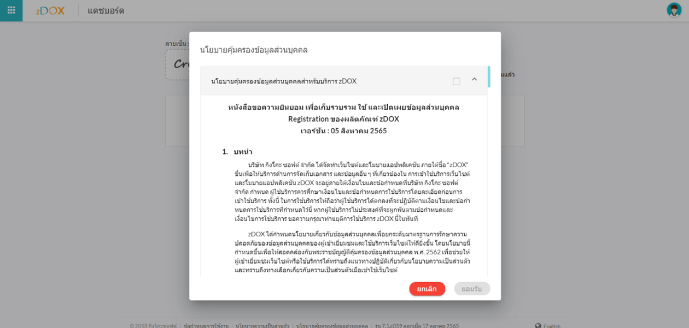
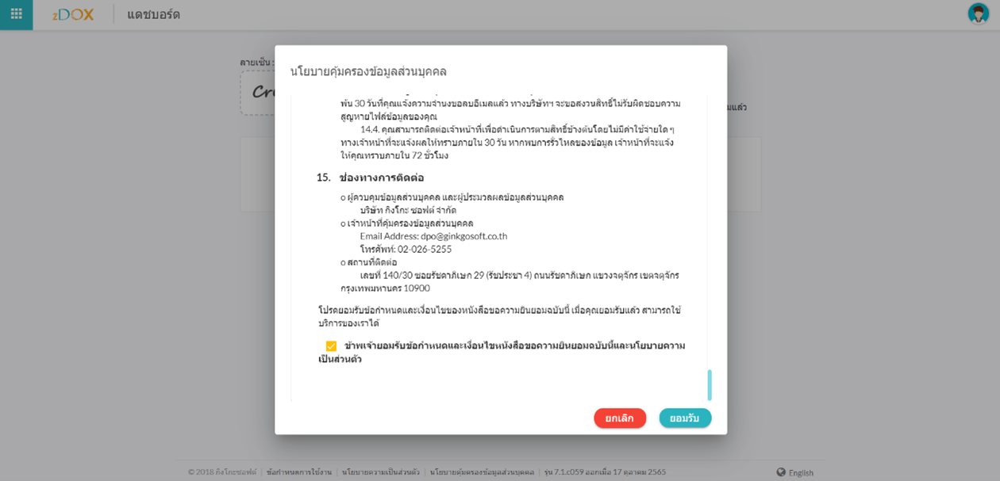

# Access to zDOX

To access the zDOX system, users can launch a web browser and input the URL zdox.net or https://www.zdox.net into the address bar. Once entered, the zDOX website will display on the screen. To initiate the login process, users can either click on the "SIGN IN" menu or manually enter the URL https://app.zdox.net/login to access the login page. zDox support the following methods for Authentication.

1. Access the system using the email and password from user registration. Refer to section 2.2.1 User Registration for more information.
2. Access the system through Facebook. Refer to section 2.2.3 User Registration and Accessing zDOX through Facebook for more information.
3.  Access the system through Google.

    Refer to section 2.2.4 User Registration and Accessing zDOX through Google for more information.

<figure><figcaption>
Select SINGIN from zDOX menu bar
</figcaption></figure>

<figure><figcaption>
Login Screen
</figcaption></figure>

<figure><figcaption>
Accessing zDOX - Data Privacy Consent Agreement Screen
</figcaption></figure>

<figure><figcaption>
Accessing zDOX - Select Checkbox to Accept Terms and Conditions, and Click "Accept" Button
</figcaption></figure>

Upon logging in to zDOX, a message screen will appear displaying a text of the consent agreement in compliance with the Personal Data Protection Act of 2019. Users are required to read through the entire agreement before clicking the "Accept" button once, unless a newer, updated version of the agreement is available.

_Note: In the event of five consecutive incorrect login attempts within 10 minutes, the system will lock the account, preventing the user from accessing the system for the duration specified in the email notification._
